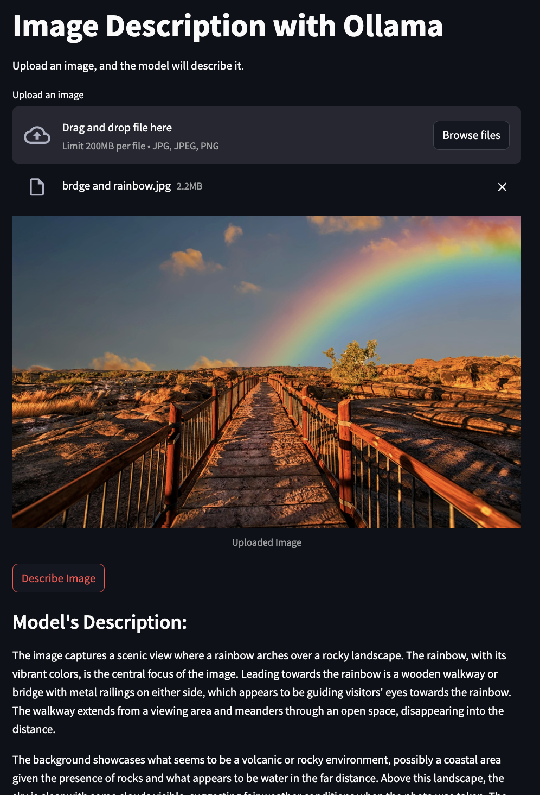

# Image Description with Ollama

This project is a simple Streamlit-based web application that allows users to upload an image and get a description of it using the Ollama `llava` model. The app provides an intuitive interface for interacting with the model, making it easy to describe uploaded images.

## Features

- Upload images in `.jpg`, `.jpeg`, or `.png` formats.
- Display the uploaded image for user confirmation.
- Use the `ollama` model to generate a description of the image.
- Streamlit interface for simplicity and accessibility.

## Requirements

To run this project, you need the following:

- Python 3.7 or higher
- Required Python libraries:
  - `streamlit`
  - `ollama`

## Installation

1. Clone this repository:
   ```bash
   git clone https://github.com/your-username/your-repo-name.git
   cd your-repo-name
   ```

2. Install the required dependencies:
   ```bash
   pip install streamlit ollama
   ```

3. Run the Streamlit app:
   ```bash
   streamlit run test.py
   ```

## Usage

1. Launch the app locally by running the above command.
2. Upload an image using the file uploader.
3. Click the "Describe Image" button to get the model's description of the image.

## Code Overview

The main functionality is implemented in the `test.py` file:

- **Image Upload:**
  Allows users to upload an image via Streamlit's `file_uploader` widget.

- **Image Display:**
  The uploaded image is displayed using `st.image()`.

- **Model Interaction:**
  The uploaded image is saved temporarily and passed to the `ollama.chat` function to get a description.

- **Error Handling:**
  Handles exceptions to ensure a smooth user experience.

## Screenshot



## Folder Structure

```plaintext
.
├── test.py               # Main application file
├── images/              # Folder for storing example images or screenshots
└── README.md            # Project documentation
```

## Example Output

- **Input:** An uploaded image of a cat.
- **Output:**
  "This is an image of a cat sitting on a windowsill, looking outside."

## Future Improvements

- Add support for multiple image uploads.
- Provide additional model configuration options.
- Enhance the UI with more styling and interactivity.

## Contributing

Contributions are welcome! Please fork this repository and submit a pull request for any enhancements or bug fixes.

## License

This project is licensed under the MIT License. See the `LICENSE` file for details.

## Acknowledgments

- [Ollama](https://www.ollama.com) for the `llava` model.
- [Streamlit](https://streamlit.io/) for making web app development so accessible.

---

Feel free to reach out if you have any questions or suggestions!
